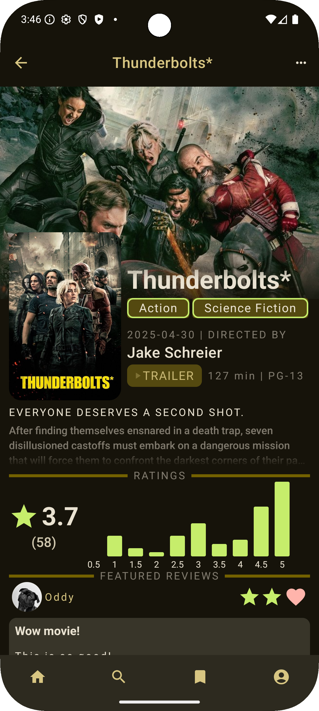
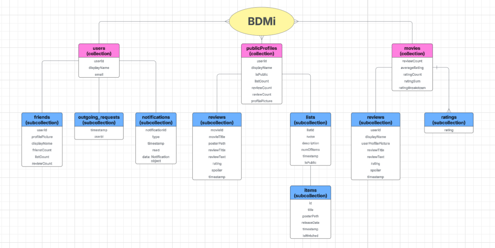
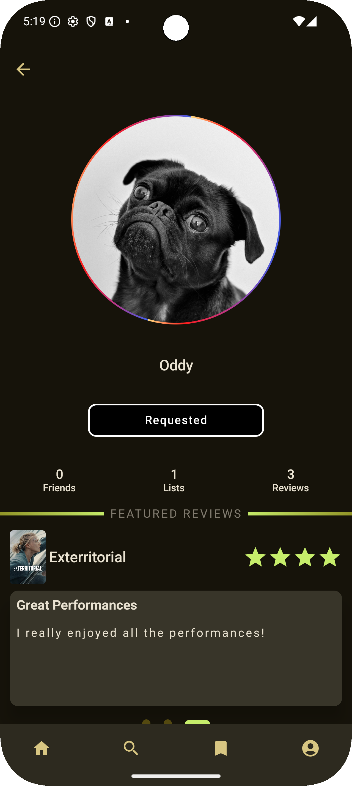
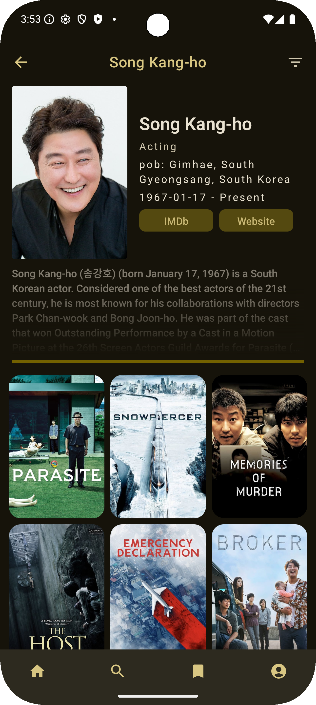

# BDMi  
**IMDb backwards.**  
A modern Android app for discovering and reviewing movies with added social features.  
Built with Kotlin, Jetpack Compose, TMDB API, and Firebase.

<div align="center">
  
  
</div>

---
## Table of Contents
- [Features](#features)
- [Tech Stack](#tech-stack)
- [Local Development Setup](#local-development-setup)
- [Project Structure](#project-structure)
- [Navigation](#navigation)
- [API](#api)
- [Database](#database)
- [Sensor](#sensor)
- [Multi-Device Support](#multi-device-support)
- [UI](#ui)
---
<a id="features"></a>
## Features
- Browse trending, popular, upcoming, or top-rated movies  
- Explore by genre, actor, country, or production studio  
- Filter by rating, vote count, release date, and more  
- Search for movies and other users  
- Write reviews with star ratings and spoiler tags  
- View detailed movie information including cast, crew, and studios  
- Add and manage friends with a mutual friendship system  
- Access friends’ reviews and public watchlists  
- Create and organize custom watchlists (public or private)  
- Responsive UI optimized for both phones and tablets  
---
<a id="tech-stack"></a>
## Tech Stack
- **Kotlin, Jetpack Compose**  
- **Hilt** – Dependency injection framework for clean architecture  
- **[TMDB API](https://developer.themoviedb.org/docs/getting-started)** – Source of movie data  
- **Retrofit** – Type-safe HTTP client  
- **Moshi** – JSON parser integrated with Retrofit  
- **OkHttp** – Underlying network client for Retrofit with logging and interceptors  
- **Firebase Firestore** – NoSQL cloud database for real-time data sync  
- **Firebase Authentication** – Secure user login and session management  
- **Coil** – Fast image loading library optimized for Compose  
- **[Cloudinary](https://cloudinary.com/)** – Cloud storage for user images and movie posters  
---
<a id="local-development-setup"></a>
## Local Development Setup
To get started with running this app locally, follow these steps:
### Setup Instructions
1. **Firebase Setup**  
   - Download the `google-services.json` file from your Firebase project (make sure the Android app is added with package name `com.example.bdmi`).  
   - Enable Firebase Authentication and enable Email/Password sign in option.  
   - Place the `google-services.json` file inside your project's `app/` directory (the file should be added to .gitignore).  
2. **API Keys**  
   - Acquire an API key from [TMDB](https://developer.themoviedb.org/docs/getting-started).  
   - Create a Cloudinary account from [here](https://cloudinary.com/console).  
3. **Secrets Configuration**  
   - Add the following to your `local.properties` file (the file should be added to .gitignore):
   ```properties
   TMDB_API_KEY=your_tmdb_key

   CLOUDINARY_CLOUD_NAME=your_cloud_name
   CLOUDINARY_API_KEY=your_cloudinary_key
   CLOUDINARY_API_SECRET=your_cloudinary_secret
   ```
---
<a id="project-structure"></a>
## Project Structure
```
app/
├── data/               # Models, repositories, and Firestore integration
│   ├── api/models/     # API models (JSON responses to Kotlin data classes)
│   ├── repositories/   # Abstraction layer for Firestore and API interactions
|   |                     Also contains all data classes/objects
|   ├── utils/          # Singleton modules for dependency injection, and other misc. objects and functions
│
├── navigation/         # Navigation graphs and route definitions
|
├── ui/                 # Jetpack Compose UI components
|   ├── composables/... # Screen specific UI elements
│   ├── profile/        # Profile screens and corresponding Hilt View Models
│   ├── theme/          # Colors, Typography, UI constants, UI dimensions
|   ├── .../            # Remaining other screen composables and corresponding view models
|
└── MainActivity.kt     # App entry point and root navigation host
```
<a id="navigation"></a>
## Navigation
```
RootNavGraph
|
├── "onboarding" ─── "start"
│                       ├── "login" ────── "root"
│                       ├── "register" ─── "root"
     │       ├── "movie_detail/{movieId}"
     │
     ├── "friend_search"
     │       ├── "user_profile/{userId}"
     │
     ├── "watchlists"
     │       ├── "watchlists/{userId}" ── "watchlist/{userId}/{listId}" 
     │                  ├── "movie_detail/{movieId}"
     ├── "user_profile/{userId}"
     │       ├── "watchlists/{userId}"
     │       ├── "user_reviews/{userId}"
├── "root"
     ├── "notification"
     │       ├── "user_profile/{userId}"
     │
     ├── "search"
     │       ├── "friends/{userId}"
     │       ├── "movie_detail/{movieId}"
     │
     ├── "home"
             ├── "movie_detail/{movieId}"
                        ├── "user_profile/{userId}"
                        ├── "reviews/{movieId}" ────── "user_profile/{userId}"
                        ├── "person/{personId}" ────── "movie_detail/{movieId}"
                        ├── "genre/{genreId}" ──────── "movie_detail/{movieId}"
                        ├── "studio/{studioId}" ────── "movie_detail/{movieId}"
                        ├── "country/{countryCode}" ── "movie_detail/{movieId}"
```
<a id="api"></a>
## API
1. 10 Unique API Endpoints Used:
   - `getPopularMovies`: Fetches trending movies in the US (20 per page).
   - `getNowPlayingMovies`: Lists movies currently in US theaters.
   - `getUpcomingMovies`: Shows upcoming movie releases.
   - `getTopRatedMovies`: Retrieves top-rated movies of all time.
   - `discoverMovies`: Flexible movie discovery with filters (genre, country, rating, etc.).
   - `searchMovies`: Returns movies matching a search query.
   - `getMovieDetails`: Returns full movie details + optional data via `append_to_response`.
   - `getMovieWatchProviders`: Lists streaming platforms where the movie is available.
   - `getCompanyDetails`: Fetches production company information.
   - `getPersonDetails`: Provides person details and combined film credits.
2. Pagination:
   - All list-fetching endpoints return paginated results (20 movies per page).
   - Supported via the `page` query parameter.
3. Chained API calls via `append_to_response`:
   - Used in `getMovieDetails` and `getPersonDetails` to bundle multiple data requests into one.
   - Reduces network requests and improves screen load times.
4. Filtering and Sorting:
   - `discoverMovies` supports sorting by popularity, revenue, release date, etc.
   - Can filter by genre, country, person, company, vote average, and vote count.
5. Region and Language Awareness:
   - Endpoints default to the `US` region and `en-US` language where applicable.
6. Screens Covered by APIs:
   - Home Screen: `getNowPlayingMovies`, `getPopularMovies`, `getTopRatedMovies`, `getUpcomingMovies`
   - Search Screen: `searchMovies`
   - Detail Screens: `getMovieDetails`, `getMovieWatchProviders`, `getCompanyDetails`, `getPersonDetails`, `discoverMovies`.
---
<a id="database"></a>
## Database
The app uses **Firebase Firestore** as its NoSQL backend, organized into three main collections:
1. `users` – Stores account-related information (e.g., userId, email)
2. `publicProfiles` – Contains publicly visible profile data (e.g., profilePicture, watchlists, reviews)
3. `movies` – Stores metadata for movies visited in the app (e.g., review counts, rating breakdown)

Each of these collections includes purpose-specific subcollections. For example, `publicProfiles` includes a `friends` subcollection for mutual friend tracking. In hindsight, this structure may be more appropriate here than in the `users` collection.

All Firestore interactions are encapsulated in feature-specific repositories under the `data/` directory. These repositories are used by our ViewModels, following a clean **repository pattern** to separate business logic from data access. This helps avoid duplication and ensures consistent access patterns across screens.

To manage read efficiency, particularly in the `movies` collection (which supports aggregate stats like review counts), we **manually update aggregate fields**. Firestore treats each document read as billable, so relying on server-side aggregation could result in prohibitively high read costs at scale. To optimize performance:
- We first check the **local snapshot cache** to avoid unnecessary reads.
- If the movie isn’t present locally, it’s added to the database with all counters initialized to `0`.

This design ensures scalability for a **read-heavy** workload without sacrificing reactivity or accuracy.



---
<a id="sensor"></a>
## Sensor
The app wraps Android’s `SpeechRecognizer` in a Kotlin class (`VoiceToTextParser`). It exposes a `StateFlow<VoiceToTextParserState>` that the UI collects to reactively show:
- `spokenText` (the latest recognized speech)
- `isSpeaking` (whether the mic is currently listening)
- `error` (any recognition error)

`startListening()`:
1. Resets state & checks availability
2. Builds an `Intent` for free‑form speech recognition
3. Attaches itself as a `RecognitionListener`
4. Calls `recognizer.startListening(...)` and sets `isSpeaking = true`

`stopListening()` simply flips `isSpeaking = false` and tells the recognizer to stop.
Recognition callbacks (`onResults`, `onError`, `onReadyForSpeech`, etc.) update the `MutableStateFlow` so the UI can react accordingly.

---
<a id="multi-device-support"></a>
## Multi-Device Support
Upon launch, the app detects the screen width dimension using Jetpack’s Window Size Classes and a simple DP check. Orientation is locked on phones, but tablets are allowed to rotate from portrait to landscape. We define three sets: Medium (Most Phones), Large (Most Tablets in Portrait), and Expanded (Most Tablets in Landscape). Each bundles together:
- `Dimens` (paddings, icon sizes, etc.)
- `Typography` (font sizes, weights, etc.)
- `UIConstants` (grid counts, aspect ratios, etc.)

A simple `when(window.widthSizeClass)` chooses which set to provide into `MaterialTheme`. The UI simply references `dimens.someValue` or `MaterialTheme.typography.someSize` and automatically scales up or down.

Tablets in landscape mode switch to a two‑pane `Row` for `MovieDetail` screen:
- Left pane shows the main detail overview: backdrop and poster, synopsis, ratings, etc.
- Right pane holds the `TabRow` and its associated content (cast, crew, explore, etc.)


---
<a id="ui"></a>
## UI
At the top level, every screen lives inside a standard `Compose Scaffold` that provides a TopAppBar, BottomNavigation, and Floating Action Button. Inside its `content {...}` block we host a `NavHost`, where each destination corresponds to a composable screen.

We follow a clear MVVM pattern: 
1. View layer simply observes state and emits user events.
2. ViewModel holds all business logic: fetching, pagination, filters, and exposes a `StateFlow<UIState>`.
3. `UIState` is simply an interface with two values: `isLoading: Boolean` and `error: APIError?`. The ViewModel sends this data to the UI, which displays states (error, loading, OK) accordingly.

<div align="center">
  
  
</div>
